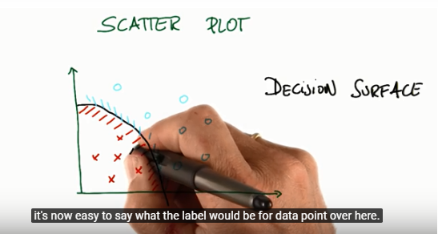

# Lesson 2 - Naive Bayes

---

- supervised classification: using examples where you already know the answer to do training

---
- Decision Surface:

---

- Gaussian NB : http://ogrisel.github.io/scikit-learn.org/sklearn-tutorial/modules/generated/sklearn.naive_bayes.GaussianNB.html
  - I tried the sample code in Anaconda/Spyder and worked.
---
- Bayes Rule:
  - [ ] Re-watch bayes rules (22-30) and add notes

---
- Naive Bayes
  - It is called naive because ignore the order
  - It is good to do classification when you a lot of features like identify an author based on the words in a book or text

---

## Mini Project
  ### Goal

  Identify if an email was written by Chris or Sarah

  ### Steps

  - clone repository: https://github.com/udacity/ud120-projects.git
  - run tools/startup.py - This will download the e-mails database
  - code is implemented in ud120-projects/naive_bayes/nb_author_id.py

  ### To-Do
  - [x] Update wiki page
  - [x] Run and publish the results using Jupyter
