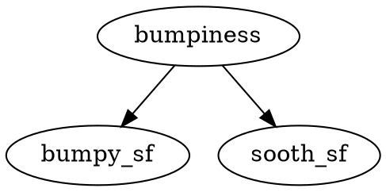

# Lesson 4 - Decision Trees

---
- Decision trees are multiple linear questions/boundaries
- Entropy - controls how a DT decides where to split the data
- (L4Q17) $entropy = -\sum(P_i * \log_2P_i)$
- (20) Entropy maximum value is 1 and it means that both classes are impure. 50% for each side.
- (L4Q21) Information gain
  $information gain = entropy(parent) - [weighted average] entropy(children)$
- L4Q30 Information gain base on bumpiness - it is zero because the result will be two leafs each one with the same number of each class (in this example one slow and one fast)

- L3Q31 Information gain base on speed limit
  - speed limit is divided in yes/no and each one results in a pure leaf. So the entropy for each group is 0.
  $inf gain = 1 - 0 = 1$

- bias - a machine data ignores new data (for example it was trained once and can not learn new things)
- variance - a machine that is very sensitive to new data and can only react in situations that it has faced before. No generalizations.

---

## Mini Project
  ### Goal

In this project, we will again try to identify the authors in a body of emails, this time using a decision tree. The starter code is in decision_tree/dt_author_id.py.
